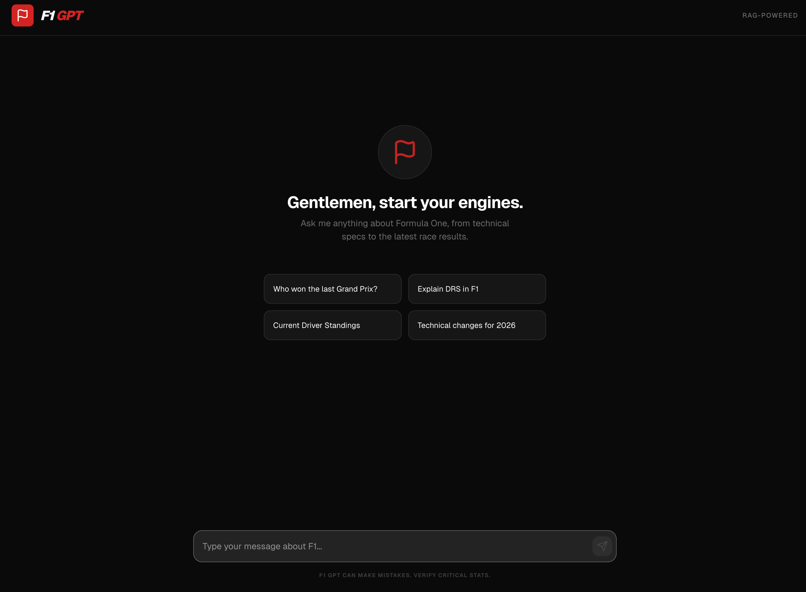
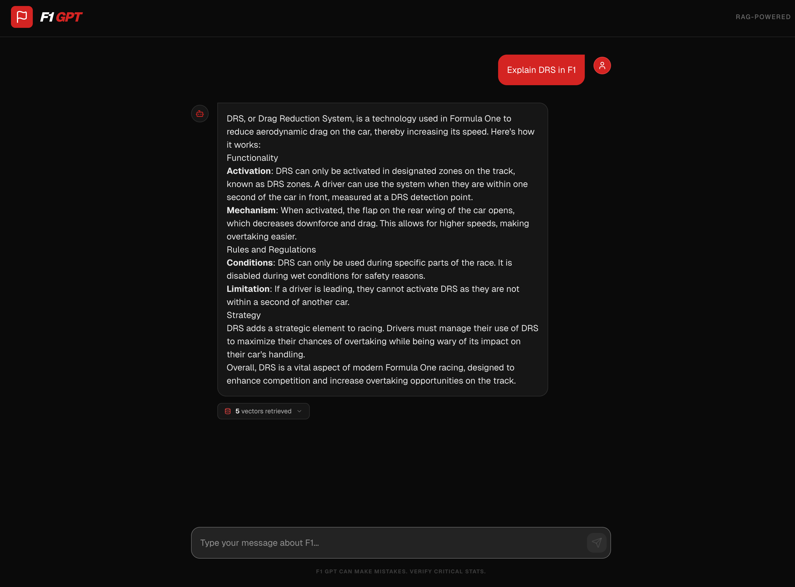

# F1 GPT

An AI-powered Formula One assistant built with **Retrieval-Augmented Generation (RAG)**. Ask anything about F1 — race results, driver standings, technical regulations, history — and get answers grounded in real F1 data retrieved from a vector database.

**Live demo:** [f1-gpt-app.bhaskarg.workers.dev](https://f1-gpt-app.bhaskarg.workers.dev/)

---

<table>
  <tr>
    <td></td>
    <td></td>
  </tr>
  <tr>
    <td align="center">Home — suggestion chips</td>
    <td align="center">Chat — RAG context panel</td>
  </tr>
</table>

---

## How it works

```
User question
     │
     ▼
Embed question (text-embedding-3-small)
     │
     ▼
Query Cloudflare Vectorize (top-5 nearest chunks)
     │
     ▼
Inject retrieved context into system prompt
     │
     ▼
Stream response via GPT-4o-mini
     │
     ▼
Display in chat UI with RAG metrics badge
```

1. **Scrape & chunk** — F1 data is scraped with Puppeteer, split into chunks, and embedded
2. **Store** — Embeddings are stored in Cloudflare Vectorize (`f1-index`)
3. **Retrieve** — At query time, the user's question is embedded and the top-5 most similar chunks are fetched
4. **Generate** — Retrieved chunks are injected into the system prompt; GPT-4o-mini streams the answer
5. **Observe** — A RAG metrics badge shows how many vectors were retrieved and their similarity scores

---

## Tech stack

| Layer | Technology |
|---|---|
| Frontend | Next.js 16, React 19, Tailwind CSS v4 |
| AI / Streaming | AI SDK v6 (`@ai-sdk/react`, `streamText`) |
| LLM | OpenAI GPT-4o-mini |
| Embeddings | OpenAI `text-embedding-3-small` |
| Vector DB | Cloudflare Vectorize |
| Deployment | Cloudflare Workers via OpenNext |
| Scraping | Puppeteer |

---

## Features

- **RAG pipeline** — grounded answers from a live F1 vector index, not just LLM hallucinations
- **Streaming responses** — token-by-token streaming via AI SDK
- **RAG metrics UI** — expandable badge shows retrieved chunk count and per-chunk similarity scores
- **Rate limiting** — server-side per-IP limiter (5 req / 60s) with live client-side countdown
- **Suggestion chips** — one-click starter questions on the empty state
- **Markdown rendering** — formatted responses with react-markdown

---

## Project structure

```
src/
├── app/
│   ├── api/
│   │   ├── chat/route.ts        # Streaming RAG chat endpoint + rate limiter
│   │   └── rag-stats/route.ts   # RAG metrics endpoint
│   ├── page.tsx                 # Chat UI
│   └── globals.css
scripts/
└── loadDb.ts                    # Scrape → embed → upload to Vectorize
```

---

## Local development

```bash
# Install dependencies
npm install

# Add your OpenAI key
echo "OPENAI_API_KEY=sk-..." >> .env.local

# Start dev server (no Vectorize — GPT base knowledge only)
npm run dev

# Start with Cloudflare Workers runtime (Vectorize available)
npm run preview
```

> **Note:** Vectorize is a Cloudflare-only service. Run `npm run preview` to test the full RAG pipeline locally. `npm run dev` falls back to GPT's base knowledge.

---

## Seed the vector database

```bash
# Scrape F1 data, generate embeddings, write vectors.ndjson
npm run seed

# Upload vectors to Cloudflare Vectorize
npm run db:upload
```

---

## Deploy

```bash
npm run deploy
```

Requires a Cloudflare account with a Vectorize index named `f1-index` and `OPENAI_API_KEY` set as a Workers secret:

```bash
wrangler secret put OPENAI_API_KEY
```

---

## What I learned

Building this project gave me hands-on experience with the full RAG stack:

- **Chunking strategy** — how chunk size affects retrieval quality
- **Embedding models** — using `text-embedding-3-small` for semantic search
- **Vector similarity** — interpreting cosine similarity scores (≥ 0.8 = strong match)
- **Prompt engineering** — injecting retrieved context without confusing the LLM
- **Streaming with AI SDK v6** — `streamText` + `toUIMessageStreamResponse()` + `useChat`
- **Edge deployment** — running a full RAG pipeline on Cloudflare Workers (no Node.js runtime)
